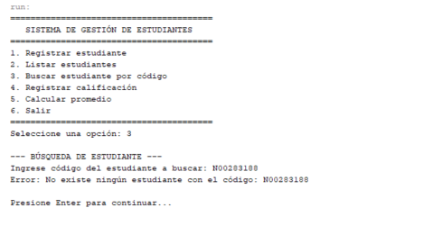

```markdown
# Sistema de Gestión de Estudiantes



Sistema de consola desarrollado en Java estándar para la administración básica de alumnos y el registro de sus calificaciones académicas en memoria. El proyecto está enfocado en la aplicación práctica de los fundamentos de la **Programación Orientada a Objetos (POO)**, separación de responsabilidades y manejo robusto de excepciones.

---

## 📌 Descripción del Problema

Una institución educativa requiere un sistema liviano para registrar estudiantes, consultar su información, asociarles calificaciones obtenidas en distintos cursos y calcular su promedio final. 

El sistema garantiza la consistencia de los datos mediante validaciones de entrada, control de códigos duplicados, límites de rango en las notas y manejo de excepciones de negocio.

---

## 🚀 Funcionalidades

1. **Registrar estudiante:** Permite dar de alta a un alumno con código, nombre y apellido.
2. **Listar estudiantes:** Muestra todos los alumnos registrados junto con la cantidad de notas que poseen.
3. **Buscar estudiante por código:** Muestra el detalle de un alumno y el desglose de todas sus materias y notas.
4. **Registrar calificación:** Asocia una calificación (nombre de materia y nota de 0.0 a 20.0) a un alumno existente.
5. **Calcular promedio:** Obtiene el promedio aritmético de las notas del estudiante o notifica si aún no tiene calificaciones.
6. **Manejo de errores:** Validación de entradas por teclado (`Scanner`) y captura de excepciones personalizadas.

---

## 📂 Estructura del Proyecto

```text
src/
├── modelo/
│   ├── Calificacion.java
│   └── Estudiante.java
│
├── servicio/
│   └── GestionEstudiantes.java
│
├── excepciones/
│   ├── CodigoDuplicadoException.java
│   ├── EstudianteNoEncontradoException.java
│   └── CalificacionInvalidaException.java
│
└── app/
    └── Main.java

```

---

## 🏗️ Responsabilidad de Clases y Paquetes

### 1. Paquete `modelo`

* **`Calificacion.java`**: Representa una evaluación individual. Contiene el nombre del `curso` (`String`) y la `nota` (`double`).
* **`Estudiante.java`**: Representa al alumno. Contiene `codigo`, `nombre`, `apellido` y encapsula su propia lista dinámica `List<Calificacion>`. Implementa el método `calcularPromedio()` aplicando el principio de **alta cohesión** (el objeto que posee los datos realiza el cálculo sobre ellos).

### 2. Paquete `servicio`

* **`GestionEstudiantes.java`**: Centraliza la lógica del negocio. Administra la colección global de estudiantes (`List<Estudiante>`), controla la unicidad de los códigos, delega las búsquedas y coordina el registro de notas.

### 3. Paquete `excepciones`

* **`CodigoDuplicadoException.java`**: Se lanza al intentar registrar un estudiante cuyo código ya existe en el sistema.
* **`EstudianteNoEncontradoException.java`**: Se lanza al buscar o intentar calificar a un estudiante con un código no registrado.
* **`CalificacionInvalidaException.java`**: Se lanza cuando el valor de la nota está fuera del rango permitido (0.0 a 20.0).

### 4. Paquete `app`

* **`Main.java`**: Capa de presentación por consola. Despliega el menú interactivo, captura las entradas del usuario con `Scanner`, limpia los datos ingresados y captura todas las excepciones para evitar caídas del programa.

---

## 📋 Reglas de Negocio

| Regla | Descripción | Manejo en el Sistema |
| --- | --- | --- |
| **Unicidad de código** | No pueden existir dos alumnos con el mismo código. | Lanza `CodigoDuplicadoException` |
| **Existencia obligatoria** | No se pueden registrar notas ni buscar alumnos inexistentes. | Lanza `EstudianteNoEncontradoException` |
| **Rango de calificaciones** | Las notas deben encontrarse estrictamente entre `0.0` y `20.0`. | Lanza `CalificacionInvalidaException` |
| **Campos obligatorios** | Código, nombre, apellido y curso no pueden estar vacíos. | Validación previa de cadenas con `.trim().isEmpty()` |
| **Promedio sin notas** | Si un alumno no tiene notas, no se debe calcular división por cero. | Validación con `.tieneCalificaciones()` |
| **Entrada numérica segura** | Si el usuario ingresa letras en opciones o notas, el sistema no se detiene. | Captura de `NumberFormatException` |

---

## 💡 Justificación de la Colección Seleccionada

Se seleccionó **`ArrayList<Estudiante>`** (implementación de la interfaz `List<Estudiante>`):

* **Flexibilidad:** Permite el crecimiento dinámico en memoria sin necesidad de definir un tamaño fijo previo.
* **Claridad pedagógica:** Los métodos nativos (`.add()`, `.size()`, bucle `for-each`) permiten explicar fácilmente el almacenamiento, la iteración y los algoritmos de búsqueda lineal sin recurrir a sobreingeniería.

---

## ⚙️ Compilación y Ejecución por Consola

Desde la carpeta raíz del proyecto (`src/`):

### 1. Compilar todas las clases:

```bash
javac modelo/*.java excepciones/*.java servicio/*.java app/*.java

```

### 2. Ejecutar la aplicación:

```bash
java app.Main

```

---

## 🧪 Casos de Prueba Recomendados para Demostración

1. **Registro normal:** Registrar el alumno `E01` - `Juan` `Perez`.
2. **Registro duplicado:** Intentar registrar nuevamente un alumno con código `E01` (comprobar que la excepción es capturada).
3. **Consulta vacía:** Intentar calcular el promedio de `E01` antes de registrar notas (comprobar el mensaje de advertencia).
4. **Registro de notas:** Asignar a `E01` la nota `18.0` en "Matemáticas" y `14.0` en "Algoritmos".
5. **Nota fuera de rango:** Intentar asignar a `E01` la nota `25.0` o `-2.0` (comprobar la excepción de rango).
6. **Búsqueda inexistente:** Intentar consultar el código `E99` (comprobar la excepción de no encontrado).
7. **Cálculo de promedio:** Calcular el promedio de `E01` (debe retornar `16.00`).

```

<FollowUp label="¿Quieres que procedamos ahora a implementar la clase de pruebas GestionEstudiantesTest.java?" query="Vamos a implementar la clase GestionEstudiantesTest.java en el paquete pruebas."/>

```
